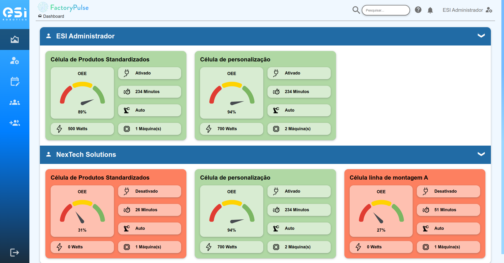
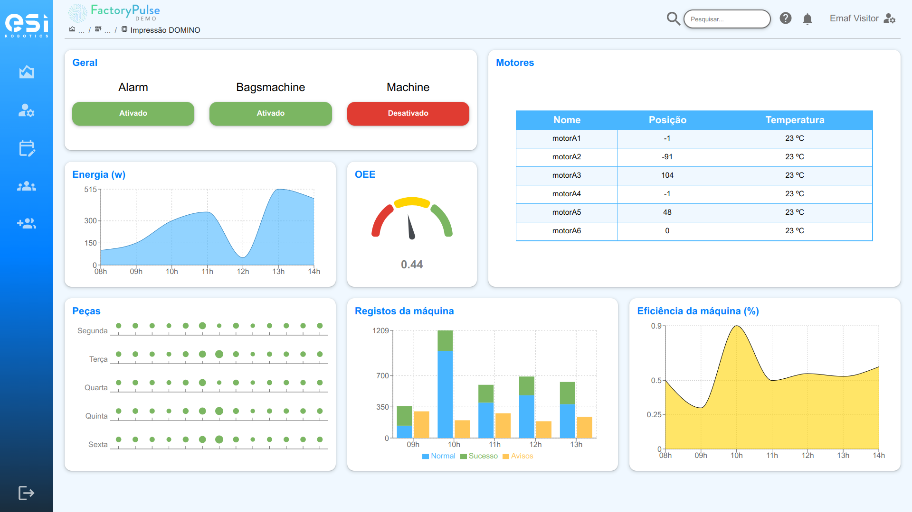
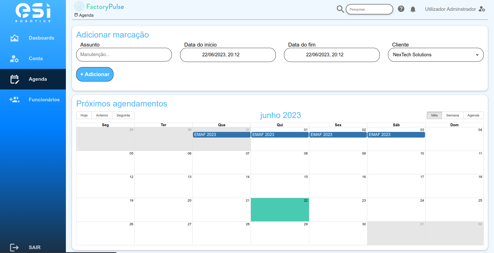
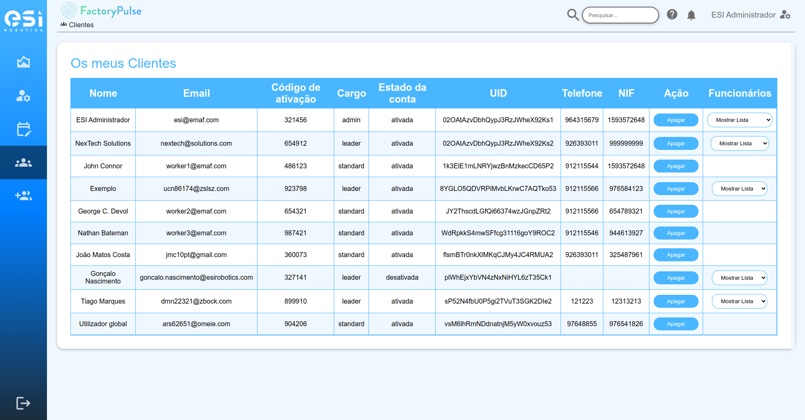

# Industry 4.0 Dashboard

## Overview

Dashboard to visualize the production, energy consumption and errors of an assembly line in real time in a factory. A platform where the administrator can monitor customers' machines remotely, schedule maintenance and repairs as well as their payments and invoices. Each customer can also view their machine data and production.


### Admin Dashboard Overview



### Energy, Production, Temperature and Efficiency of a machine



### Schedule maintenance 



### Customer list management 



## Features

-   **Real-time Monitoring**: Track and display live data on temperature, energy, production.
-   **Monitor customers' machines remotely**: Schedule maintenance and repairs as well as their payments and invoices
-   **Responsive Design**: Accessible and fully functional on both mobile devices and desktop computers.
-   **Interactive UI**: Built with React for a dynamic and responsive user experience.

## Technologies

-   **Frontend**: React
-   **Backend**: Google Cloud Platform
-   **Styling**: CSS
-   **Build Tool**: Vite
-   **Platform**: Mobile and Desktop

1. Clone the repository:

    ```bash
    git clone https://github.com/tyhago14/Industry-4.0-Dashboard.git

    ```

2. Install the dependencies:

    ```bash
    npm install

    ```

3. Start the development server
    ```bash
    npm run dev
    ```
## Contributing

We welcome contributions to enhance the Smart Home Dashboard! Please refer to our [contributing guidelines](CONTRIBUTING.md) for more details.
